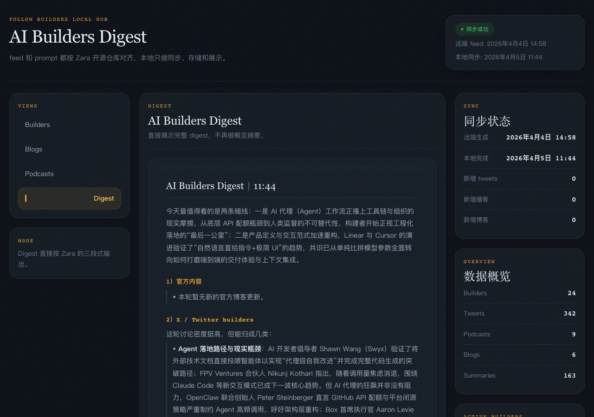
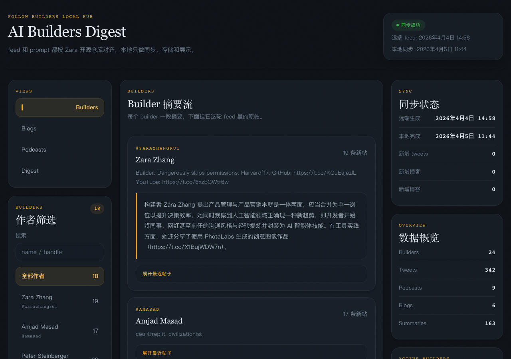
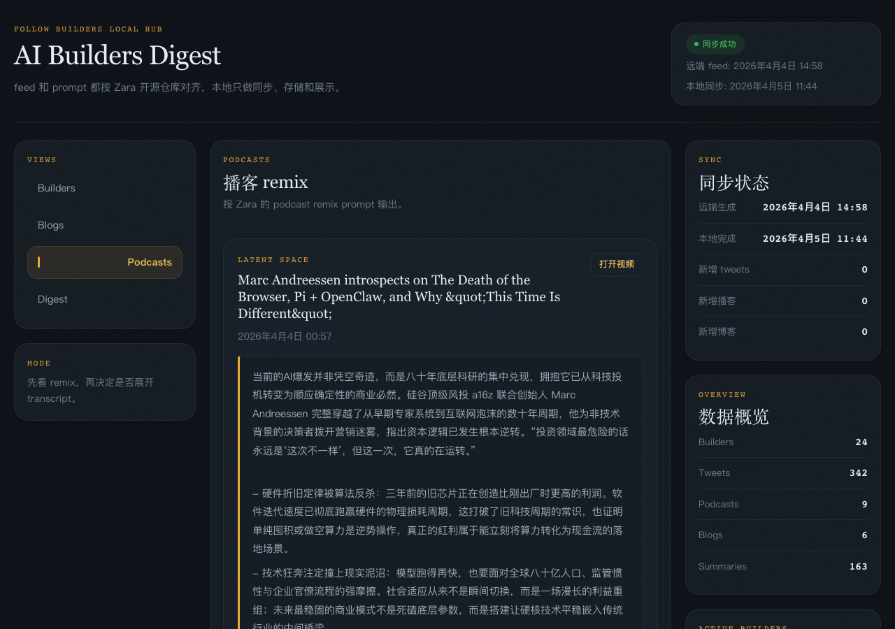

# Follow Builders Local Hub

[中文](./README.zh.md) | English

A local self-hosted hub that syncs the [follow-builders](https://github.com/zarazhangrui/follow-builders) public feed, generates AI summaries in Chinese, and delivers a daily digest to your Telegram.

Feed sources, prompt design, and builder list all follow the upstream open-source repo. This project handles sync, storage, summarization, and display.

## Live Demo

**[builders.purrcdn.com](https://builders.purrcdn.com)** — a live instance running on a Mac Mini M4.

## Screenshots

| Digest | Builders | Podcasts |
|--------|----------|----------|
|  |  |  |

## What it does

- Syncs X (Twitter) feeds, podcast episodes, and blog posts from the public follow-builders feed
- Generates Chinese summaries using any OpenAI-compatible model
- Builds a daily digest and pushes it to Telegram
- Serves a local read-only dashboard at `http://localhost:3000`

## Requirements

- Node.js 22+
- pnpm
- An OpenAI-compatible API key (OpenRouter free tier works)

## Setup

### 1. Clone and install

```bash
git clone https://github.com/zarazhangrui/follow-builders-local-hub.git
cd follow-builders-local-hub
pnpm install
```

### 2. Configure the app

Copy the example config:

```bash
cp config/config.example.json config/config.json
```

`config/config.json` controls feed URLs, summary behavior, and model selection. The defaults work out of the box.

### 3. Set your API keys

Create `.env.local` in the project root:

```bash
# Required: OpenRouter (free tier works)
OPENROUTER_API_KEY=your_key_here
OPENROUTER_DEFAULT_MODEL=qwen/qwen3.6-plus:free

# Optional: Telegram push notifications
TELEGRAM_BOT_TOKEN=your_bot_token
TELEGRAM_CHAT_ID=your_chat_id

# Optional: fallback model when primary hits rate limits
CAOWO_API_KEY=your_key_here
CAOWO_MODEL=gpt-5.4-mini
```

**Where to get these:**

| Key | Where |
|-----|-------|
| `OPENROUTER_API_KEY` | [openrouter.ai/keys](https://openrouter.ai/keys) — free tier available |
| `TELEGRAM_BOT_TOKEN` | Create a bot via [@BotFather](https://t.me/BotFather) on Telegram |
| `TELEGRAM_CHAT_ID` | Send a message to your bot, then call `https://api.telegram.org/bot<TOKEN>/getUpdates` |

### 4. Build and run

```bash
pnpm build
node node_modules/next/dist/bin/next start
```

The dashboard is available at `http://localhost:3000`.

### 5. Trigger your first sync

```bash
curl -X POST http://localhost:3000/api/sync
```

### 6. Generate summaries

```bash
OPENROUTER_API_KEY=your_key OPENROUTER_DEFAULT_MODEL=qwen/qwen3.6-plus:free \
  pnpm tsx scripts/refresh-summaries.ts
```

## Running with PM2

For persistent background operation:

```bash
npm install -g pm2
pm2 start node --name follow-builders -- node_modules/next/dist/bin/next start
pm2 save
pm2 startup  # follow the printed instruction to enable autostart
```

## Public access via Cloudflare Tunnel

To access the dashboard from outside your local network:

```bash
brew install cloudflare/cloudflare/cloudflared
cloudflared tunnel login
cloudflared tunnel create follow-builders
cloudflared tunnel route dns follow-builders your.domain.com
```

Create `~/.cloudflared/config.yml`:

```yaml
tunnel: <your-tunnel-id>
credentials-file: /Users/<you>/.cloudflared/<your-tunnel-id>.json
protocol: http2

ingress:
  - hostname: your.domain.com
    service: http://localhost:3000
  - service: http_status:404
```

Then run:

```bash
pm2 start "cloudflared tunnel run follow-builders" --name cloudflared
pm2 save
```

## Project structure

```
app/          Next.js App Router pages and API routes
components/   Dashboard UI
lib/          Core logic (sync, summarizer, db, model config)
prompts/      Prompt templates for summarization
scripts/      CLI utilities (refresh-summaries, deploy)
config/       config.example.json — copy to config.json
```

## Credits

Feed data and prompt design by [Zara](https://github.com/zarazhangrui/follow-builders).
